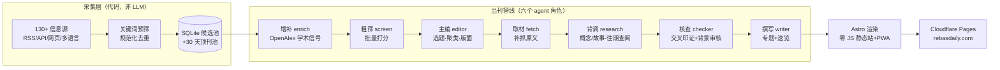

<p align="center">
  <a href="https://rebasdaily.com"></a>
</p>

<h1 align="center">Rebas Daily</h1>

<p align="center">
一份完全由 AI 管线自动采集、编选、核查、撰写与出版的个人日刊。<br>
<sub>A fully autonomous, multi-agent daily publication pipeline.</sub>
</p>

<p align="center">
  <b>📰 在线阅读 → <a href="https://rebasdaily.com">rebasdaily.com</a></b>
</p>

---

每天达拉斯时间零点，[rebasdaily.com](https://rebasdaily.com) 自动出一期新刊：**学术 / 开源 / 科技 / 数据 / 商业 / 量化 / 设计 / 艺术** 八个板块，130+ 信息源的数百条候选被蒸馏成 60~80 篇中文报道——选题、交叉核查、背景铺垫、撰写、排版、部署，全程无人参与。

信息源是**国际视野**的：从 arXiv、Nature/Science 等顶刊、硅谷公司博客，到中国 AI 媒体（DeepSeek 生态）、日欧设计杂志与国际设计奖项——中英日多语言内容进同一条管线（下游 LLM 语言无关），统一产出中文刊物。

运行成本：**一台 $7/月 的 VPS + 一份闲置的 ChatGPT 订阅**（LLM 调用走 Codex CLI 消化订阅额度，零 API 账单）+ Cloudflare Pages 免费托管。

本仓库是这条管线的完整骨架。它是**配置驱动**的：信息源（`config/sources.toml`）、兴趣画像（`config/profiles/`）、提示词（`config/prompts/`）全部是可编辑的文本——换一套配置，就能长出一份主题完全不同的刊物。

## 管线架构



### 六个 agent 角色

| 角色 | 职责 | 关键设计 |
|---|---|---|
| **粗筛** | 数百条候选按画像批量打分 | 用 mini 档模型省额度；榜单类源自带质量信号直通 |
| **主编** | 选题、事件聚类、定版面 | 材料深度决定篇幅；宁缺毋滥不凑数；thread_key 事件线跨日去重；收尾批**补充轮**给薄板块用当日新候选补选；顶刊池候选跨期可选、不算旧闻 |
| **背调** | 给选题配背景材料 | 双模式：技术板块=概念解释，人文板块=背景故事；可查閱 30 天往期做连续报道衔接 |
| **核查** | 簇内交叉印证 + 审校背调产物 | 独立信源计数定可信度；背景逐条 ok/fix/drop，宁删勿留 |
| **撰写** | 专题长文 + 速览短报道 | **防幻觉铁律**：事实只认供稿材料，背景只认审核后的背景块；论文专题抓 arXiv 原文**精读**（用完即删不进库） |
| **文风** | `style.md` 单点调节全刊语域 | "给聪明但不搞技术的朋友讲最新进展"：准确、松弛、克制；术语宁多勿少地解释，复杂工作用生活化例子开场 |

## 值得参考的设计决策

- **防幻觉的双材料制**——writer 被禁止使用自身知识：报道事实只能来自供稿材料，领域背景只能来自"背调 agent 产出 + 核查 agent 审校"的背景块。两条供给线各有独立纪律，写手专心写作。
- **可靠性三件套**——每个阶段幂等（重跑自动跳过已完成的）、`issues.status` 断点续跑（跨日失败自动续）、板块级容错（单板块失败不中断整期）。cron 无人值守的自愈全靠这套。
- **顶刊供给三层**——期刊官方 feed 死了不算完：OpenAlex 目录 API（AoS/JASA）与 JMLR 官网卷页解析做兜底通道，条目**反向映射回 arXiv**（enrich 反查与全文精读直接可用，并与在库预印本自动合并——顶刊收录信号挂上原条目即天然加权）；顶刊候选独立 **30 天池**（约一个刊期），落选不清扫，周末论文真空由池补齐。
- **订阅额度当 API 用**——LLM 抽象层走 Codex CLI 无头调用，白天四主批备刊 + 20:00 兜底批，每批恰好落在订阅的一个 5 小时额度窗口内；发布闸门让午夜翻牌零 token。批间顺延与兜底**零显式检测**：状态检查点 + 板块级幂等让"重试已完成的批"是纯空转（实测 0.7 秒）。
- **零 JS 前端**——纯静态 HTML（CSS 全内联，file:// 直开可用），数学公式在**构建期** LaTeX→MathML（浏览器原生渲染，不引 KaTeX）；PWA 的 Service Worker 只做离线兜底，页面渲染不依赖 JS。
- **采集层用 urllib 而非 httpx**——Cloudflare 按 TLS 指纹拦截，httpx 全军覆没、urllib 全源畅通。管线里最省钱的一行经验。
- **渲染期保留策略**——文章永存数据库，静态页面只出最近一周；调大 `site_keep_days` 重渲染即可整体找回，数据与展示解耦。

## 技术栈

`Python 3.12`（标准库 HTTP + feedparser + trafilatura） · `SQLite` 单文件 · `Codex CLI`（LLM 后端，可切 OpenAI API） · `Astro 5`（SSG） · `Cloudflare Pages` · `cron + healthchecks.io` · `FastAPI` 管理后台（备稿监控 / 画像与出刊参数在线编辑 / 报道反馈池，经 Cloudflare Tunnel 暴露，零入站端口）

## 跑起来

```bash
python3 -m venv .venv && .venv/bin/pip install -e .
# 配置 LLM 后端（.codex/ 或 API key）与信息源后：
rebas collect        # 采集入池
rebas publish        # 出一期刊（全管线）
rebas render         # 重渲染静态站 → site/
```

完整的日常操作、云端部署（VPS 三步就绪脚本）、cron 批次模型与运维须知见 **[docs/OPERATIONS.md](docs/OPERATIONS.md)**。

## 声明

刊物内容由 AI 自动采集与撰写，可能存在错误、遗漏或滞后，不构成投资、法律或其他专业建议。品牌图形资产不随仓库分发。疑问、勘误或权利相关事宜请联系 **weiyixin9512@gmail.com**。
